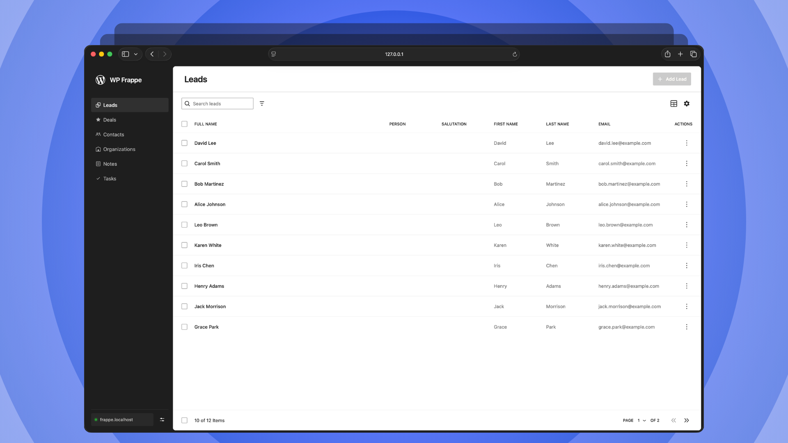

<p align="center"></p>



[![Playground Demo Link](https://img.shields.io/badge/Live%20Preview-3858e9?style=for-the-badge&logo=data%3Aimage%2Fsvg%2Bxml%3Bbase64%2CCjxzdmcgeG1sbnM9Imh0dHA6Ly93d3cudzMub3JnLzIwMDAvc3ZnIiB3aWR0aD0iMTAwIiBoZWlnaHQ9IjEwMCIgZmlsbD0ibm9uZSI%2BPHBhdGggZmlsbD0iI2ZmZiIgZmlsbC1ydWxlPSJldmVub2RkIiBkPSJNMTEuOSAzNi40MjVjLTIuMTgxIDMuMDA3LTMuMzMyIDYuNzAzLTMuNTE3IDEwLjc2NWEyNi40MyAyNi40MyAwIDAgMC0uMDE0IDEuOTk4Yy4yNzYgOS4xMzggNS4xMzQgMTkuNzggMTMuODk4IDI4LjU0NEMzNS42NzggOTEuMTQ0IDUzLjQ5MiA5NS40MSA2My41NzUgODguMWMtNC4yNDEtMS04LjUzMi0yLjU1OC0xMi43NTctNC42MzVhMjMuMDE5IDIzLjAxOSAwIDAgMS0zLjUwMi0uNDRjLTIuMTM5LS40MjctNC40LTEuMTYxLTYuNzAzLTIuMjA2LTQuMjEzLTEuOTEtOC41NjgtNC44NTctMTIuNTcyLTguODYxLTQuMDA0LTQuMDA0LTYuOTUtOC4zNTgtOC44Ni0xMi41Ny0xLjA0NS0yLjMwNC0xLjc4LTQuNTY2LTIuMjA3LTYuNzA0YTIzLjAwNiAyMy4wMDYgMCAwIDEtLjQzOS0zLjUwMWMtMi4wNzgtNC4yMjYtMy42MzYtOC41MTctNC42MzYtMTIuNzU4Wm0tOC40MDEgMjUuNDNjLjMwNS0uMzA1LjYyNS0uNTkuOTYtLjg1NGE1MC4zNzIgNTAuMzcyIDAgMCAwIDMuODY4IDguNTI2Yy0uMjE0Ljk0My0uMjYgMi4yMzUuMDg3IDMuOTY2LjY4OCAzLjQzNyAyLjgzMSA3LjY1NyA2LjYzNCAxMS40NiAzLjgwMiAzLjgwMiA4LjAyMiA1Ljk0NSAxMS40NTkgNi42MzMgMS43MzIuMzQ2IDMuMDI0LjMwMSAzLjk2Ny4wODdBNTAuMzc1IDUwLjM3NSAwIDAgMCAzOSA5NS41NDFjLS4yNjQuMzM0LS41NS42NTUtLjg1NS45Ni02LjM3OCA2LjM3OC0xOS4zMDQgMy43OTMtMjguODcyLTUuNzc0Qy0uMjk0IDgxLjE1OS0yLjg3OSA2OC4yMzMgMy41IDYxLjg1NVptMzEuNzYgMi44ODZDNTQuMzkyIDgzLjg3NSA4MC4yNDUgODkuMDQ2IDkzLjAwMSA3Ni4yOWM0LjYxMy00LjYxMyA2Ljg4MS0xMC45MzcgNi45OTQtMTguMDM3LjE5OC0xMi41MzYtNi4zMjctMjcuNDktMTguNTQzLTM5LjcwNkM2Mi4zMi0uNTg4IDM2LjQ2Ni01Ljc2IDIzLjcxIDYuOTk3Yy00LjYxOCA0LjYyLTYuODg3IDEwLjk1NC02Ljk5NCAxOC4wNjYtLjE4NyAxMi41MyA2LjMzNiAyNy40NzEgMTguNTQzIDM5LjY3OFptMjYuOTQ2IDMuMzk1Yy4zNTYgMS43NzcuNDkyIDMuMzg0LjQ1IDQuODI3LTcuMTg1LTIuNTAxLTE0LjgtNy4xNzQtMjEuNjIyLTEzLjk5Ni02LjgyMi02LjgyMi0xMS40OTUtMTQuNDM3LTEzLjk5Ni0yMS42MjMgMS40NDItLjA0IDMuMDUuMDk1IDQuODI2LjQ1IDYuMDUgMS4yMSAxMy4wODEgNC44NzMgMTkuMjc2IDExLjA2NyA2LjE5NCA2LjE5NSA5Ljg1NyAxMy4yMjYgMTEuMDY2IDE5LjI3NVpNMjkuNDg0IDEyLjc3MmMtMy40NTggMy40NTgtNS4zMDIgOS4wOC00LjM3MyAxNi41MjEgOS43ODEtLjk1IDIxLjk3MyAzLjk2NSAzMS44MDIgMTMuNzk0IDkuODI4IDkuODI4IDE0Ljc0NSAyMi4wMiAxMy43OTQgMzEuODAxIDcuNDQuOTMgMTMuMDYzLS45MTUgMTYuNTItNC4zNzIgMy44NDgtMy44NDcgNS42OTgtMTAuMzc2IDMuOTUyLTE5LjEwNC0xLjczMi04LjY2Mi02LjkxNC0xOC41MDUtMTUuNS0yNy4wOTEtOC41ODYtOC41ODYtMTguNDMtMTMuNzY4LTI3LjA5MS0xNS41LTguNzI5LTEuNzQ2LTE1LjI1Ny4xMDQtMTkuMTA0IDMuOTUxWiIgY2xpcC1ydWxlPSJldmVub2RkIi8%2BPC9zdmc%2B&logoSize=auto)](https://playground.wordpress.net/?blueprint-url=https://raw.githubusercontent.com/lubusIN/wpui-frappe-plugin-starter/playground/_playground/blueprint-github.json)
# WPUI Frappe Plugin Starter

A full-featured standalone WordPress plugin starter and template repository demonstrating how to use `@lubusin/wp-frappe-data-store` to build rich, reactive CRM administration interfaces inside WordPress.

This plugin showcases modern WordPress engineering practices, featuring a full-screen admin application powered by **`@wordpress/boot`** and the next-generation **`@wordpress/build`** tooling.

> [!CAUTION]
> Project is currently under active development.

## Quickstart

You can instantly test and interact with this plugin locally without installing Docker, MySQL, or a local PHP server! We include a pre-configured WordPress Playground setup.

### Prerequisites
- Node.js 20+ and npm
- WordPress 7.0+ (or a compatible Gutenberg plugin that provides `@wordpress/boot`)
- PHP 7.4+

### Build & Run

From the root directory:

```bash
# 1. Install workspace dependencies
npm install

# 2. Build production bundle (or use `npm run dev` for watch mode)
npm run build

# 3. Start WordPress Playground server locally
npm run playground
```

Running `npm run playground` will automatically:
1. Boot a local WordPress instance using `@wp-playground/cli`.
2. Mount and activate the plugin (`wpui-frappe-plugin-starter.php`).
3. Log you in as `admin`.
4. Open your browser directly to the CRM Dashboard.

**Connecting to Frappe**: Once the app opens, enter the Frappe CRM origin and choose either username/password login or a dedicated API key/secret. Passwords are never persisted; Frappe sessions and API tokens remain server-side.

## Advanced Configuration & Deployment

This plugin starter includes several advanced configurations and deployment setups. Please refer to the **[Starter Templates Documentation](https://wp-frappe-data.lubus.in/guide/starter-templates)** for detailed guides on:

- **Architectural Insights** (Server-side REST API proxy, `@wordpress/boot` usage)
- **Production Connection** (Storing credentials securely in `wp-config.php`)
- **Local Development Flags** (Allowing local/insecure origins)
- **Quality and Release** (Building the installable plugin ZIP)

## Contributing

Contributions are welcome! Please feel free to submit a Pull Request.

## Support

For issues and feature requests, please use the GitHub issue tracker.

## Meet Your Artisans

[LUBUS](https://lubus.in/?utm_source=github&utm_medium=open-source&utm_campaign=wpui-frappe-plugin-starter) is a web design agency based in Mumbai.

<a href="https://cal.com/lubus">

</a>

## License

WPUI Frappe Plugin Starter is licensed under the MIT License.
